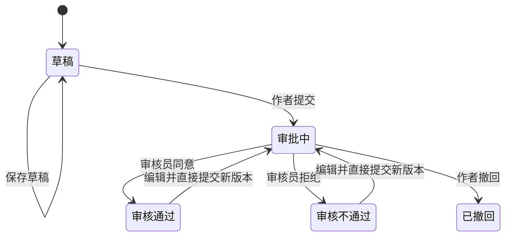

# 通用审批与文章审核需求分析

## 1. 文档目的

本文档整理 CMS 审批功能的已确认需求和技术方案。

当前首先实现文章审核，但审批能力不能与文章类型绑定。后续应能够扩展到图片、视频、商品等其他业务对象。

## 2. 核心业务规则

### 2.1 文章发布规则

文章是否对外展示由两个条件共同决定：

1. 文章存在审核通过的发布版本。
2. 文章自身处于有效状态。

判断规则：

```ts
const publiclyVisible =
  article.status === 1 && article.publishedRevisionId !== null
```

字段语义：

- `status = 1`：文章有效，可以对外展示审核通过的版本。
- `status = 0`：文章失效，相当于下架，不对外展示。
- 修改 `status` 不改变审批状态和审批历史。
- 失效文章重新启用后，继续展示最近一次审核通过的版本。
- 从未审核通过的文章即使 `status = 1`，也不能对外展示。

### 2.2 审核通过与发布

审核通过即代表对应文章版本可以发布。

审核通过时，后端将文章的 `publishedRevisionId` 指向本次审核通过的版本。此前存在已发布版本时，由新版本替换旧版本。

### 2.3 审批期间的线上内容

已经发布的文章再次编辑并提交审核时：

- 当前已发布版本继续对外展示。
- 新修改内容保存在新的审批中版本。
- 新版本审核通过后才替换线上版本。
- 新版本被拒绝或撤回时，线上版本不受影响。

## 3. 为什么不使用临时文章表

不创建一张复制文章全部字段的临时表。

临时表存在以下问题：

- 文章增加字段时需要同步维护两套表结构。
- 分类、标签等关系也要复制两套关联逻辑。
- 审核通过时需要执行大量字段复制。
- 容易丢失历史审核内容。
- 无法自然支持多次修改和多版本审核。

采用永久的文章版本表 `article_revisions` 保存每次需要审核的文章内容。

## 4. 数据模型

### 4.1 文章主对象

`articles` 保存文章的稳定身份、作者和当前发布指针，不直接承担审批内容快照的职责。

建议核心字段：

```ts
class Article {
  id: number

  // 作者
  authorId: number

  // 0：失效/下架，1：有效
  status: number

  // 当前对外展示的审核通过版本
  publishedRevisionId: number | null

  createdAt: Date
  updatedAt: Date
}
```

### 4.2 文章版本

`article_revisions` 保存实际被审核的文章内容。

```ts
enum ArticleRevisionStatus {
  DRAFT = 'draft',
  PENDING = 'pending',
  APPROVED = 'approved',
  REJECTED = 'rejected',
  WITHDRAWN = 'withdrawn',
}

class ArticleRevision {
  id: number
  articleId: number
  version: number

  title: string
  summary: string | null
  content: string
  coverUrl: string | null
  categoryId: number
  tags: Tag[]

  workflowStatus: ArticleRevisionStatus

  createdAt: Date
  updatedAt: Date
}
```

文章版本必须保存当次审核所涉及的完整内容，包括分类和标签关系。

### 4.3 通用审批申请

审批申请不能写死为文章审批。统一使用 `approval_requests`：

```ts
enum ApprovalStatus {
  PENDING = 'pending',
  APPROVED = 'approved',
  REJECTED = 'rejected',
  WITHDRAWN = 'withdrawn',
}

class ApprovalRequest {
  id: number

  // article_revision、image 等
  subjectType: string

  // 对应业务对象 ID
  subjectId: number

  applicantId: number
  reviewerId: number | null

  status: ApprovalStatus
  rejectionReason: string | null

  submittedAt: Date
  reviewedAt: Date | null
  withdrawnAt: Date | null

  metadata: Record<string, unknown> | null
}
```

文章审批目标：

```text
subjectType = article_revision
subjectId = ArticleRevision.id
```

未来图片审批目标：

```text
subjectType = image
subjectId = Image.id
```

业务内容不保存在审批申请表中。审批申请只负责指出审核对象、申请人、审核人和当前审批结果。

### 4.4 审批操作流水

使用 `approval_records` 保存不可修改的审批操作历史：

```ts
enum ApprovalAction {
  SUBMIT = 'submit',
  APPROVE = 'approve',
  REJECT = 'reject',
  WITHDRAW = 'withdraw',
}

class ApprovalRecord {
  id: number
  approvalRequestId: number
  action: ApprovalAction
  operatorId: number
  reason: string | null
  createdAt: Date
}
```

每次重新提交审批都创建新的 `ApprovalRequest`，不复用已拒绝或已撤回的审批申请。

## 5. 审核内容保存位置

审核内容保存在对应业务对象中，不保存在通用审批表中：

| 审批类型 | 审核内容保存位置             |
| -------- | ---------------------------- |
| 文章     | `article_revisions`          |
| 图片     | `images` 和本地/OSS 文件对象 |
| 视频     | 未来的 `videos`              |
| 其他业务 | 对应业务版本表或业务对象表   |

审核员查询审批详情时，审批服务根据 `subjectType` 找到业务处理器，再通过 `subjectId` 查询具体内容。

文章审批详情返回示例：

```json
{
  "approval": {
    "id": 100,
    "subjectType": "article_revision",
    "subjectId": 12,
    "status": "pending",
    "applicantId": 5,
    "submittedAt": "2026-07-11T10:00:00.000Z"
  },
  "subject": {
    "id": 12,
    "articleId": 3,
    "version": 2,
    "title": "CMS 使用指南",
    "content": "<p>需要审核的正文</p>",
    "category": {},
    "tags": []
  }
}
```

## 6. 编辑规则

业务要求：除审批中和已撤回状态外，其他状态均允许用户进入编辑页面。

“允许编辑”不代表直接覆盖原审核版本。

| 当前状态   | 是否允许编辑 | 保存行为                           |
| ---------- | ------------ | ---------------------------------- |
| 草稿       | 是           | 可以继续保存当前草稿，或提交审核   |
| 审批中     | 否           | 返回 HTTP `409`                    |
| 审核通过   | 是           | 编辑完成后创建新版本并直接提交审核 |
| 审核不通过 | 是           | 编辑完成后创建新版本并直接提交审核 |
| 已撤回     | 否           | 返回 HTTP `409`                    |

审核通过和审核不通过的文章编辑后不创建一个可长期停留的草稿。用户点击提交时，后端直接：

1. 创建新的 `ArticleRevision`。
2. 将新版本状态设置为 `PENDING`。
3. 创建新的 `ApprovalRequest`。
4. 写入 `ApprovalRecord(SUBMIT)`。

原审核版本保持不可修改，用于保证线上内容和审批历史不被篡改。

## 7. 状态流转



限制：

- 只有审批中的版本可以被通过或拒绝。
- 只有审批中的版本可以撤回。
- 审批中的版本禁止修改。
- 已撤回版本禁止修改。
- 审核通过和审核不通过的历史版本禁止原地修改。
- 拒绝时理由必填，建议限制为 1～500 个字符。
- 非拒绝状态的 `rejectionReason` 必须为空。
- 非法状态流转返回 HTTP `409 Conflict`。

## 8. 权限规则

### 8.1 作者

- 创建文章时，当前登录用户自动成为作者。
- 前端不能自行指定 `authorId`。
- 仅文章作者可以提交审批。
- 仅文章作者可以撤回自己的待审批版本。
- 文章作者可以编辑草稿、审核通过和审核不通过的文章。
- 文章作者不能编辑审批中和已撤回的版本。

### 8.2 审核员

- 管理员或具有审核权限的角色可以查询待审核数据。
- 具有审核权限的用户可以通过或拒绝审批。
- 普通作者不能调用审批通过或审批拒绝接口。

### 8.3 上下架权限

文章 `status` 控制有效或失效。建议仅管理员、内容管理员或具有文章上下架权限的用户可以修改。

## 9. 通用审批处理器

通用审批服务不能直接包含文章发布逻辑。每种审批目标提供独立处理器：

```ts
interface ApprovalSubjectHandler {
  subjectType: string

  ensureExists(subjectId: number): Promise<void>
  canSubmit(subjectId: number, userId: number): Promise<boolean>
  canWithdraw(subjectId: number, userId: number): Promise<boolean>

  onSubmitted(subjectId: number): Promise<void>
  onApproved(subjectId: number, reviewerId: number): Promise<void>
  onRejected(
    subjectId: number,
    reviewerId: number,
    reason: string,
  ): Promise<void>
  onWithdrawn(subjectId: number, userId: number): Promise<void>
}
```

文章处理器：

```text
subjectType = article_revision
```

图片处理器：

```text
subjectType = image
```

审批服务根据 `subjectType` 从处理器注册表中找到对应处理器。

## 10. 接口设计

### 10.1 草稿文章提交审批

```http
POST /api/article-revisions/:id/submit
```

仅作者可以提交自己的草稿版本。

### 10.2 审核通过或不通过文章的编辑提交

```http
POST /api/articles/:id/submit-revision
Content-Type: application/json
```

请求体包含编辑后的完整文章内容：

```json
{
  "title": "修改后的标题",
  "summary": "修改后的摘要",
  "content": "<p>修改后的正文</p>",
  "coverUrl": "/uploads/images/new-cover.jpg",
  "categoryId": 2,
  "tagIds": [1, 3]
}
```

该接口不保存中间草稿，而是直接创建审批中版本并发起审批。

### 10.3 作者撤回

```http
POST /api/article-revisions/:id/withdraw
```

仅作者可以撤回自己的审批中版本。

### 10.4 审批列表

```http
GET /api/approvals?status=pending&subjectType=article_revision
```

复用通用分页结构，不单独创建文章待审核列表接口。

### 10.5 审批详情

```http
GET /api/approvals/:id
```

返回审批信息和对应业务审核内容。

### 10.6 审核通过

```http
POST /api/approvals/:id/approve
```

### 10.7 审核拒绝

```http
POST /api/approvals/:id/reject
Content-Type: application/json
```

```json
{
  "reason": "内容中的数据来源不明确，请补充引用。"
}
```

## 11. 事务要求

以下操作必须在同一个数据库事务中完成。

### 11.1 提交审批

1. 校验当前用户是文章作者。
2. 校验当前没有审批中的版本。
3. 校验文章内容、分类和标签。
4. 创建或更新目标文章版本。
5. 将版本状态设置为 `PENDING`。
6. 创建 `ApprovalRequest(PENDING)`。
7. 创建 `ApprovalRecord(SUBMIT)`。
8. 提交事务。

任一步骤失败时，不能保留版本、审批申请或审批流水中的部分数据。

### 11.2 审核通过

1. 锁定审批申请，防止重复审核。
2. 校验申请仍为 `PENDING`。
3. 校验审核员权限。
4. 将审批申请和文章版本标记为 `APPROVED`。
5. 更新文章 `publishedRevisionId`。
6. 写入 `ApprovalRecord(APPROVE)`。
7. 提交事务。

### 11.3 审核拒绝与撤回

审批拒绝和撤回同样必须原子更新审批申请、业务版本状态和审批流水。

## 12. 并发和数据完整性

- 同一个文章同时只能存在一个审批中的版本。
- 审核操作需要使用事务和行锁，避免两名审核员重复处理。
- 已提交的审批内容必须保持不可变。
- 审批目标建议使用软删除，避免历史审批记录失去业务对象。
- `subjectType + subjectId` 的有效性由对应审批处理器校验。
- 可选增加审核内容 SHA-256，用于检测审批期间的异常内容修改。

## 13. 前端交互要求

### 13.1 草稿

显示：

- 保存草稿
- 提交审核

### 13.2 审批中

显示：

- 审批中状态
- 作者可见撤回按钮

不显示编辑按钮。

### 13.3 审核通过

- 显示已发布状态。
- 允许作者进入编辑页面。
- 编辑页面提交按钮文案为“提交审核”。
- 提交后线上继续展示原审核通过版本。

### 13.4 审核不通过

- 显示拒绝理由。
- 允许作者进入编辑页面。
- 编辑完成后直接提交新一轮审核。

### 13.5 已撤回

- 不显示编辑按钮。
- 不允许再次提交同一个版本。

## 14. 已确认决策

1. 审核通过即代表对外发布。
2. `status` 同时控制文章是否对外有效，失效即下架。
3. 审批期间继续展示上一审核通过版本。
4. 不使用临时文章表，使用文章版本表。
5. 审批对象必须是通用对象，不能与文章写死。
6. 审核内容保存在业务版本对象中，不保存在通用审批表中。
7. 仅文章作者可以提交或撤回。
8. 审批中和已撤回状态禁止编辑。
9. 审核通过和审核不通过状态允许编辑。
10. 审核通过或审核不通过的文章编辑完成后，不保存中间草稿，直接创建审批中版本并发起审批。

## 15. 待确认事项

以下事项尚未最终确认：

1. 审核员是否允许审核自己创建的文章。
2. 管理员是否可以代替作者撤回审批。
3. 已撤回版本是否允许通过“复制为新版本”重新发起审批。
4. 分类或标签被删除时，历史文章版本如何展示对应信息。
5. 是否在第一期实现审批内容哈希校验。
6. 是否需要审批评论、多人会签或多级审批，为后续扩展预留到什么程度。
