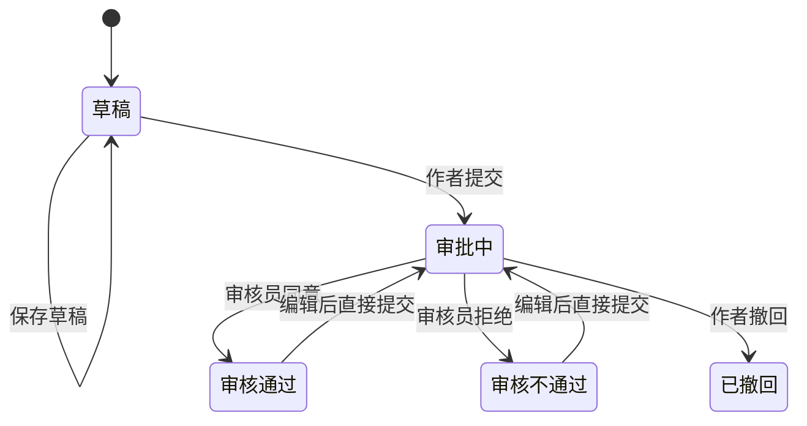

# 文章审批与发布快照需求分析

## 1. 方案概述

文章审批采用“原始文章表 + 已发布文章表”的双表方案，不创建通用审批表、文章版本表或临时审批表。

- `articles`：保存后台当前编辑内容和审批状态。
- `published_articles`：保存最近一次审核通过、可供前台查询的文章快照。
- `article_tags`：保存后台文章当前选择的标签。
- `published_article_tags`：保存最近一次审核通过的标签关系。
- 分类和标签是系统内部维护数据，自身不参与审批。
- 前台公开接口只查询发布表及发布侧标签关系，不读取原始文章表的内容和关系。

该方案的核心目标是：作者修改文章和等待审批期间，前台仍然可以读取最近一次审核通过的内容。

### 1.1 当前实施阶段

第一阶段暂不创建 `published_articles` 和 `published_article_tags`，也不提供公开文章接口。

- 审核通过时先输出日志 `文章[标题]已发布`，然后将原始文章审批状态改为 `APPROVED`。
- 撤回时先输出日志 `文章[标题]已撤回`，然后将原始文章审批状态改为 `WITHDRAWN`。
- 后续实现发布表时，再将日志占位替换为事务性的发布快照写入或删除。

## 2. 已确认的业务规则

1. 用户创建文章后，文章默认为草稿状态。
2. 仅文章作者可以提交审批和撤回审批。
3. 提交审批后，文章状态变为审批中。
4. 审批员可以同意或拒绝审批。
5. 拒绝审批时必须填写拒绝理由。
6. 审核通过即代表文章可以对外发布。
7. 审核通过时，将原始文章的最新业务数据全量同步到发布表。
8. 文章的 `status` 表示是否有效：有效时可以展示，失效时相当于下架。
9. 修改 `status` 不改变文章的审批状态。
10. 分类和标签不参与审批，但文章选择的分类和标签属于文章发布快照的一部分。
11. 只有审批中或已下架（`status = 0`）的文章禁止编辑和提交，其他审批状态均允许。
12. 编辑操作不改变审批状态；作者需要显式调用提交接口进入新一轮审批。

## 3. 数据模型

### 3.1 原始文章表

`articles` 保存后台当前内容和审批信息。

```ts
enum ArticleApprovalStatus {
  DRAFT = 'draft',
  PENDING = 'pending',
  APPROVED = 'approved',
  REJECTED = 'rejected',
  WITHDRAWN = 'withdrawn',
}

class Article {
  id: number

  title: string
  summary: string | null
  content: string
  coverUrl: string | null

  status: number
  sort: number

  authorId: number
  categoryId: number
  tags: Tag[]

  approvalStatus: ArticleApprovalStatus
  rejectionReason: string | null
  submittedAt: Date | null
  reviewedAt: Date | null
  reviewerId: number | null

  createdAt: Date
  updatedAt: Date
}
```

字段说明：

- `status = 1`：文章有效。
- `status = 0`：文章失效，相当于下架。
- `approvalStatus`：当前工作内容的审批状态。
- `rejectionReason`：只有审核不通过时有值，其他状态必须为空。
- `authorId`：文章作者，由后端根据当前登录用户设置，前端不能指定。
- `reviewerId`：最后一次执行通过或拒绝操作的审核员。

### 3.2 已发布文章表

`published_articles` 保存最近一次审核通过的文章业务快照。

除审批相关字段外，发布表与原始文章表的业务字段保持一致。

```ts
class PublishedArticle {
  // 与 Article.id 保持一致
  id: number

  title: string
  summary: string | null
  content: string
  coverUrl: string | null

  status: number
  sort: number

  authorId: number
  categoryId: number
  tags: Tag[]

  createdAt: Date
  updatedAt: Date
  publishedAt: Date
}
```

发布表不包含：

```text
approvalStatus
rejectionReason
submittedAt
reviewedAt
reviewerId
```

建议使用原始文章 ID 作为发布表主键：

```sql
published_articles.id = articles.id
```

并建立外键：

```sql
FOREIGN KEY (id) REFERENCES articles(id) ON DELETE CASCADE
```

### 3.3 字段同步约束

发布表不是部分字段的展示表，而是完整的已审核业务快照。

以后为文章增加任何非审批业务字段时，必须同时完成：

1. 修改 `Article`。
2. 修改 `PublishedArticle`。
3. 修改数据库结构。
4. 修改审核通过时的同步映射。
5. 补充同步测试。

建议抽取共享字段定义或统一映射函数，降低字段遗漏风险。

## 4. 分类与标签

### 4.1 分类

分类自身由系统内部直接维护，不参与审批。

两张文章表分别保存分类 ID：

```text
articles.category_id
published_articles.category_id
```

后台文章按分类查询：

```sql
SELECT *
FROM articles
WHERE category_id = ?;
```

公开文章按分类查询：

```sql
SELECT *
FROM published_articles
WHERE category_id = ?
  AND status = 1;
```

文章在审批中修改 `articles.category_id` 时，不影响 `published_articles.category_id`。

### 4.2 标签

标签自身由系统内部直接维护，不参与审批。

原始文章和发布文章分别使用自己的标签关联表：

```text
article_tags
published_article_tags
```

推荐结构：

```sql
CREATE TABLE published_article_tags (
  article_id INT NOT NULL,
  tag_id INT NOT NULL,
  PRIMARY KEY (article_id, tag_id),
  FOREIGN KEY (article_id)
    REFERENCES published_articles(id)
    ON DELETE CASCADE,
  FOREIGN KEY (tag_id)
    REFERENCES tags(id)
    ON DELETE RESTRICT
);
```

公开文章按标签查询：

```sql
SELECT pa.*
FROM published_articles pa
INNER JOIN published_article_tags pat
  ON pat.article_id = pa.id
WHERE pat.tag_id = ?
  AND pa.status = 1;
```

公开查询不访问 `articles` 或 `article_tags`，因此未审核的分类和标签选择不会提前生效。

### 4.3 分类和标签信息变更

分类名称、标签名称和描述等基础信息不保存额外快照。

前台读取发布文章时，可以关联当前 `categories` 和 `tags` 数据。因此系统管理员修改分类或标签名称后，前台可以立即显示最新名称，无需重新审批文章。

## 5. 审批状态流转



状态限制：

- 草稿、审核通过、审核不通过、已撤回状态均可以发起审批。
- 只有审批中状态可以被审核通过或审核拒绝。
- 只有审批中状态可以撤回。
- 审批中的文章禁止编辑。
- 已下架（`status = 0`）的文章禁止编辑和提交。
- 非法状态流转返回 HTTP `409 Conflict`。

## 6. 编辑规则

| 当前状态   | 是否允许编辑 | 保存行为                     |
| ---------- | ------------ | ---------------------------- |
| 草稿       | 是           | 可以保存草稿或提交审批       |
| 审批中     | 否           | 返回 HTTP `409`              |
| 审核通过   | 是           | 保存后保持审核通过           |
| 审核不通过 | 是           | 保存后保持审核不通过         |
| 已撤回     | 是           | 保存后保持已撤回，可再次提交 |

无论审批状态为何，只要文章已下架（`status = 0`），都禁止编辑和提交审批。

编辑操作只更新 `articles` 中的业务内容，不改变 `approvalStatus`。作者显式提交审批时，
才将状态设置为 `PENDING`，并清空上一次拒绝理由和审核信息。

因此，审批期间前台仍然读取上一次审核通过的发布快照。

## 7. 审批操作

### 7.1 创建文章

1. 根据当前用户设置 `authorId`。
2. 创建原始文章。
3. 设置 `approvalStatus = DRAFT`。
4. 不创建发布表记录。

### 7.2 提交审批

提交人必须是文章作者。

```text
approvalStatus = PENDING
rejectionReason = null
submittedAt = 当前时间
reviewedAt = null
reviewerId = null
```

提交审批不修改发布表。

### 7.3 审核通过

审核通过时，在同一个数据库事务中：

1. 锁定原始文章。
2. 校验当前状态为 `PENDING`。
3. 校验当前用户具有审核权限。
4. 将原始文章全部业务字段同步到 `published_articles`。
5. 全量替换 `published_article_tags`。
6. 将原始文章状态更新为 `APPROVED`。
7. 清空拒绝理由。
8. 设置审核员和审核时间。
9. 提交事务。

发布记录已存在时执行更新，不存在时执行创建。

任何一步失败时必须回滚全部操作，不能出现文章已通过但发布数据未同步完整的情况。

### 7.4 审核拒绝

审核拒绝只修改原始文章：

```text
approvalStatus = REJECTED
rejectionReason = 必填拒绝理由
reviewerId = 当前审核员
reviewedAt = 当前时间
```

发布表和发布标签关系保持不变。

拒绝理由建议限制为 1～500 个字符。

### 7.5 撤回

按当前提出的业务方案，作者撤回审批时：

1. 校验当前状态为 `PENDING`。
2. 校验当前用户是文章作者。
3. 删除对应的 `published_article_tags`。
4. 删除对应的 `published_articles`。
5. 将原始文章状态更新为 `WITHDRAWN`。
6. 提交事务。

该规则意味着：如果文章以前已经发布，作者撤回新一轮审批时，旧的线上版本也会立即下架。

这一行为与通常的“仅撤回本轮修改”不同，但本方案按“撤回同时撤销发布”定义执行。前端应明确提示：

```text
撤回后文章将从前台下架；文章仍可编辑，并可再次提交审批。
```

## 8. 有效与失效

`status` 不是审批字段，两张表都保存该字段。

文章已经存在发布记录时，修改有效状态需要在同一事务中同步两张表：

```ts
await transaction(async (manager) => {
  await manager.update(Article, id, { status })
  await manager.update(PublishedArticle, id, { status })
})
```

- `status = 0`：发布记录保留，但前台查询不到，相当于下架。
- `status = 1`：发布记录重新可见。
- 尚未审核通过、没有发布记录的文章只更新原始表。

公开接口必须始终带上：

```sql
WHERE published_articles.status = 1
```

## 9. 权限规则

### 9.1 作者

- 创建文章时由后端自动设置作者。
- 仅作者可以保存自己的草稿。
- 仅作者可以提交审批。
- 仅作者可以撤回审批。
- 作者不能编辑或提交审批中、已下架的文章。
- 已撤回且有效的文章可以继续编辑并再次提交。

### 9.2 审核员

- 管理员或拥有文章审核权限的用户可以查询待审核文章。
- 审核员可以同意或拒绝审批。
- 拒绝时必须填写拒绝理由。

### 9.3 上下架权限

建议只有管理员、内容管理员或具有上下架权限的用户可以修改 `status`。

## 10. 接口设计

### 10.1 后台文章接口

后台接口读取 `articles`：

```http
GET  /api/articles
GET  /api/articles/:id
POST /api/articles
PUT  /api/articles/:id
```

### 10.2 提交审批

草稿提交：

```http
POST /api/articles/:id/submit
```

草稿、审核通过、审核不通过或已撤回的文章都通过同一接口显式提交：

```http
POST /api/articles/:id/submit
```

### 10.3 审核操作

```http
POST /api/articles/:id/approve
POST /api/articles/:id/reject
POST /api/articles/:id/withdraw
```

拒绝请求：

```json
{
  "reason": "文章中的数据来源不明确，请补充引用。"
}
```

### 10.4 待审核查询

复用后台文章分页接口：

```http
GET /api/articles?approvalStatus=pending&page=1&pageSize=10
```

### 10.5 有效状态

```http
PUT /api/articles/:id/status
```

### 10.6 公开文章接口

公开接口只读取 `published_articles`、`published_article_tags`、`categories` 和 `tags`：

```http
GET /api/public/articles
GET /api/public/articles/:id
```

支持的主要查询条件：

```http
GET /api/public/articles?categoryId=2
GET /api/public/articles?tagId=3
GET /api/public/articles?title=NestJS
```

公开接口不得回查 `articles` 或 `article_tags` 获取文章业务内容和文章标签关系。

## 11. 事务与并发要求

以下操作必须使用数据库事务：

- 审核通过并同步发布快照。
- 撤回并删除发布快照。
- 修改有效状态并同步发布状态。
- 删除文章和关联发布数据。

审核操作需要锁定原始文章记录，避免：

- 两名审核员同时处理同一文章。
- 作者在审核过程中修改文章。
- 重复通过、重复拒绝或重复撤回。

建议通过条件更新或悲观锁保证状态一致：

```sql
UPDATE articles
SET approval_status = 'approved'
WHERE id = ?
  AND approval_status = 'pending';
```

受影响行数不是 1 时，返回 HTTP `409 Conflict`。

## 12. 前端交互要求

### 12.1 草稿

显示：

- 编辑
- 保存草稿
- 提交审核

### 12.2 审批中

显示：

- 审批中状态
- 作者可见撤回按钮

不显示编辑按钮。

### 12.3 审核通过

- 显示已发布状态。
- 允许作者编辑。
- 编辑保存后状态不变，可点击“提交审核”。
- 新一轮审批期间继续展示当前发布快照。

### 12.4 审核不通过

- 显示拒绝理由。
- 允许作者编辑。
- 编辑保存后状态不变，可点击“提交审核”。

### 12.5 已撤回

- 显示编辑和提交按钮。
- 明确显示文章已从前台下架。
- 允许再次提交同一文章。

## 13. 方案优点

- 数据结构比通用审批和文章版本方案简单。
- 不需要审批表和审批处理器注册机制。
- 后台编辑内容与前台发布内容完全隔离。
- 审批中和审核拒绝不会覆盖线上内容。
- 前台查询只依赖发布侧数据，边界清晰。
- 分类和标签可以继续使用现有系统管理能力。
- 发布表天然适合作为公开查询模型。

## 14. 方案限制

- 只能保留最近一次审核通过的内容。
- 不保存完整审批历史。
- 无法查看过去发布过的文章版本。
- 无法统计历史拒绝次数和每一次拒绝理由。
- 其他类型的审批需要各自实现状态和发布逻辑。
- 原始表和发布表字段高度重复，需要严格维护同步映射。
- 按当前撤回定义，撤回新一轮审批会同时删除旧发布快照。

如果未来需要完整审计、多级审批、多人会签或历史版本回滚，需要重新引入审批记录表或版本表。

## 15. 验收标准

1. 新建文章默认为草稿，公开接口不可见。
2. 只有作者可以提交或撤回文章。
3. 提交后文章进入审批中且禁止编辑。
4. 审核通过后发布表包含原始文章的全部非审批业务字段。
5. 审核通过后发布标签关系与原始标签关系一致。
6. 审核拒绝时保存拒绝理由，发布表不发生变化。
7. 已发布文章重新编辑和审批期间，前台继续展示旧发布快照。
8. 新一轮审核通过后，发布快照被完整替换。
9. 分类查询只使用 `published_articles.category_id`。
10. 标签查询只使用 `published_article_tags.tag_id`。
11. 公开查询不读取原始文章内容或原始标签关系。
12. 设置 `status = 0` 后文章立即从公开接口消失。
13. 设置 `status = 1` 后已有发布快照重新可见。
14. 撤回审批后发布记录和发布标签关系被删除。
15. 审核同步任一步骤失败时，原始状态和发布数据全部回滚。
