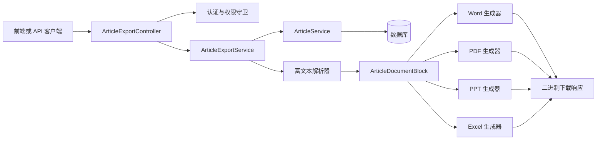
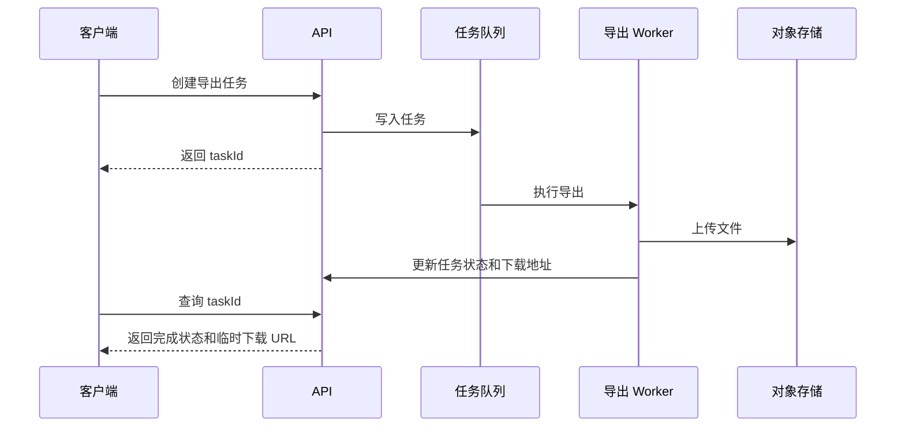

# 文章多格式导出需求分析与实现设计

## 1. 文档目的

本文说明 CMS 如何实现文章导出能力，当前格式包括：

- Word（`.docx`）
- PDF（`.pdf`）
- PowerPoint（`.pptx`）
- Excel（`.xlsx`）

设计同时考虑后续扩展 CSV、HTML、Markdown、EPUB、纯文本、图片包或 ZIP 离线包等格式，
避免每增加一种格式就复制控制器、查询和权限逻辑。

本文既描述当前项目中的实际实现，也给出数据量增大后的演进方案。

## 2. 需求分析

### 2.1 业务目标

导出功能需要满足以下业务场景：

1. 用户在文章详情页下载单篇文章，用于归档、打印、审阅或离线阅读。
2. 用户在文章列表页导出全部文章，用于汇报、统计、迁移或批量交付。
3. 不同文件格式应体现各自用途，而不是简单地把同一段文本放进不同扩展名的文件。
4. 导出结果应包含足够的文章元数据，并正确显示中文。
5. 后续新增格式时，不应改变文章核心业务服务。

### 2.2 当前导出规则

| 范围     | 格式  | 业务语义                           | 权限           |
| -------- | ----- | ---------------------------------- | -------------- |
| 指定文章 | Word  | 完整、可编辑的文章文档             | `article:view` |
| 指定文章 | PDF   | 完整、适合阅读和打印的固定版式文档 | `article:view` |
| 全部文章 | PPT   | 每一页对应一篇文章，用于汇报或浏览 | `article:list` |
| 全部文章 | Excel | 每一行对应一篇文章，用于筛选和分析 | `article:list` |

PPT 为满足“一页一篇文章”，正文过长时只显示适合单页阅读的摘录。Excel 保存完整的正文
纯文本，不对正文做截断。

### 2.3 导出字段

不同格式可根据用途选择字段，但数据源统一来自文章及其关联数据：

- 文章 ID
- 标题
- 摘要
- 富文本正文
- 封面地址
- 分类
- 标签
- 作者
- 有效状态
- 审批状态
- 发布时间
- 创建时间
- 更新时间

### 2.4 非功能要求

#### 正确性

- 导出的文章数量和查询结果一致。
- PPT 页数应等于文章数量；没有文章时允许生成一页空状态说明。
- Excel 每篇文章只能占一行，表头不计入文章行数。
- Word/PDF 必须保留正文的主要结构，例如标题、段落、列表、引用和代码块。

#### 兼容性

- 文件必须使用标准 OOXML 或 PDF 格式，能够被常见办公软件打开。
- 中文文件名应同时提供 UTF-8 文件名和 ASCII 回退文件名。
- PDF 应嵌入或引用可用的中文字体，避免中文显示为方框。

#### 安全性

- 导出接口必须经过认证和权限校验。
- 不直接信任客户端传入的文件名、字体路径或 HTML。
- 不由服务端任意下载富文本中的外部图片，避免 SSRF。
- 忽略正文中的 `script`、`style` 和 `noscript` 内容。
- 不在导出日志中输出密码、令牌、SMTP 凭证或其他敏感配置。

#### 性能

- 小数据量可以同步生成并直接返回文件流。
- 大数据量应切换为异步导出任务，避免长时间占用 HTTP 连接和应用内存。
- 批量导出查询必须显式加载所需关联，避免逐篇文章触发 N+1 查询。

#### 可维护性

- HTTP 下载、数据查询、富文本解析和各格式渲染应分层处理。
- 各格式生成器不应自行查询数据库或判断用户权限。
- 新格式应通过统一导出接口或格式注册表接入。

## 3. 接口设计

### 3.1 指定文章导出

```http
GET /api/articles/:id/export?format=word
GET /api/articles/:id/export?format=pdf
```

要求 `article:view` 权限。

### 3.2 全部文章导出

```http
GET /api/articles/export?format=ppt
GET /api/articles/export?format=excel
```

要求 `article:list` 权限。批量导出不使用列表接口的 `page` 和 `pageSize`，而是读取全部
符合导出规则的文章。

### 3.3 为什么拆成两个路径

指定文章和全部文章具有不同的权限、数据量和文件语义。拆分路径可以避免以下问题：

- `id` 是否必填变得含糊。
- Word/PDF 被误用于无上限批量生成。
- PPT/Excel 被误解为只包含当前文章。
- 动态路由 `/api/articles/:id` 抢先匹配 `/api/articles/export`。

在 NestJS 模块中，静态导出控制器应先于包含 `:id` 的文章控制器注册，确保
`/api/articles/export` 不会被当作文章 ID 解析。

### 3.4 下载响应

导出接口直接返回二进制文件，不使用普通 API 的
`{ code, message, data }` JSON 响应外壳。

关键响应头：

```http
Content-Type: application/pdf
Content-Length: 12345
Content-Disposition: attachment; filename="articles-1.pdf"; filename*=UTF-8''...
```

当前控制器使用 NestJS `StreamableFile` 返回文件，并通过 `filename*` 支持中文文件名。

## 4. 总体架构



各层职责：

| 层                   | 职责                                         |
| -------------------- | -------------------------------------------- |
| Controller           | 校验路径和格式参数、声明权限、设置下载响应头 |
| ArticleExportService | 编排查询、格式选择、文件名和 MIME 类型       |
| ArticleService       | 查询文章、分类、标签、作者和审核员           |
| 富文本解析器         | 将 HTML 转换为格式无关的内容块               |
| 格式生成器           | 把文章和内容块转换为具体文件格式             |

## 5. 统一内容模型

文章正文以 HTML 保存。直接让每个格式生成器分别解析 HTML 会产生重复逻辑，并导致
不同格式对同一正文的理解不一致。因此应先转换为中间表示：

```ts
type ArticleDocumentBlock =
  | { type: 'heading'; level: 1 | 2 | 3; text: string }
  | { type: 'paragraph'; text: string }
  | { type: 'list'; ordered: boolean; items: string[] }
  | { type: 'quote'; text: string }
  | { type: 'code'; text: string }
  | { type: 'image'; alt: string; source: string }
  | { type: 'rule' }
```

当前解析器支持：

- `h1`～`h6`，统一映射到三级标题。
- `p` 段落。
- `ul`、`ol` 和 `li` 列表。
- `blockquote` 引用。
- `pre` 和 `code` 代码块。
- `img` 图片说明和来源地址。
- `hr` 分隔线。
- 常见容器元素的递归遍历。

解析时移除多余空白，并忽略可执行或纯样式节点。图片只保留说明和来源地址，不主动
请求图片 URL。

## 6. 数据查询实现

### 6.1 指定文章

指定文章通过 `findOneWithCategory(id)` 查询，并一次性加载：

- `category`
- `tags`
- `author`
- `reviewer`

不存在时返回 HTTP 404。

### 6.2 全部文章

批量导出使用独立的 `findAllForExport()`，不复用分页列表结果：

```ts
return repository.find({
  relations: { category: true, tags: true, author: true, reviewer: true },
  order: { sort: 'ASC', id: 'ASC' },
})
```

这样可以保证：

- 导出不遗漏分页之外的数据。
- 顺序稳定，可重复验证。
- 关联数据一次性加载，避免 N+1 查询。

如果以后需要“导出筛选结果”，应定义独立的导出查询 DTO，白名单化允许的筛选字段，
而不是原样接受任意列表查询参数。

## 7. 各格式实现方法

### 7.1 Word

实现库：`docx`

生成步骤：

1. 创建 OOXML 文档并设置文档元数据。
2. 设置页面大小、页边距、页眉和页脚。
3. 定义标题、摘要、正文和三级标题样式。
4. 定义真实的项目符号和编号列表。
5. 将 `ArticleDocumentBlock` 映射为 Word 段落。
6. 使用 `Packer.toBuffer()` 输出 `.docx`。

Word 适合完整保留文章正文，并允许用户继续编辑。标题、列表和页码应使用 Word 原生
结构，不应通过手工空格或 Unicode 字符模拟。

### 7.2 PDF

实现库：`pdfkit`

生成步骤：

1. 创建固定页面尺寸和页边距。
2. 注册中文字体。
3. 输出标题、摘要和元数据。
4. 按内容块输出正文并自动分页。
5. 在所有缓冲页写入页码。
6. 收集 PDF 数据流并合并为 `Buffer`。

PDF 的关键难点是字体。当前实现按以下顺序处理：

1. 优先使用 `ARTICLE_EXPORT_PDF_FONT_PATH` 指定的字体。
2. 自动探测 Windows、Linux 和 macOS 的常见中文字体。
3. 如果仍找不到字体，返回 HTTP 503，并提示部署人员配置字体。

TTC 字体集合还需要配置：

```dotenv
ARTICLE_EXPORT_PDF_FONT_PATH=/path/to/NotoSansCJK-Regular.ttc
ARTICLE_EXPORT_PDF_FONT_FAMILY=Noto Sans CJK SC
```

### 7.3 PowerPoint

实现库：`pptxgenjs`

当前业务规则是“全部文章导出，每一页对应一篇文章”。每页包含：

- 分类和文章 ID
- 标题
- 摘要
- 正文摘录
- 作者、标签、发布时间和有效状态
- 当前页数和总页数

PPT 的主要约束是单页容量。当前实现把富文本转换为可阅读文本，并把正文限制在适合
单页显示的长度。这里的截断是格式语义的一部分：PPT 用于呈现，不用于保存完整原文。

设计时应遵守：

- 一页只有一篇文章。
- 标题字号和视觉层级保持一致。
- 正文过长时截断，不通过无限缩小字体强行塞入。
- 没有文章时生成一页明确的空状态，而不是生成损坏或无页面的文件。

### 7.4 Excel

实现库：`exceljs`

当前业务规则是“全部文章导出，每一行对应一篇文章”。工作表包含以下列：

```text
文章 ID、标题、摘要、正文、分类、标签、作者、有效状态、审批状态、
发布时间、创建时间、更新时间、封面地址
```

生成时：

- 使用 Excel 表格结构提供筛选。
- 冻结首行。
- 隐藏默认网格线并使用明确的表头样式。
- 日期写入为真实日期值，并设置 `yyyy-mm-dd` 格式。
- 正文保留完整纯文本并启用自动换行。
- 根据正文长度适当增加行高，同时设置最大行高，避免工作表失去可用性。

Excel 面向筛选、迁移和分析，因此不应像 PPT 一样截断正文。

## 8. 文件名与 MIME 类型

| 格式  | 扩展名  | MIME 类型                                                                   |
| ----- | ------- | --------------------------------------------------------------------------- |
| Word  | `.docx` | `application/vnd.openxmlformats-officedocument.wordprocessingml.document`   |
| PDF   | `.pdf`  | `application/pdf`                                                           |
| PPT   | `.pptx` | `application/vnd.openxmlformats-officedocument.presentationml.presentation` |
| Excel | `.xlsx` | `application/vnd.openxmlformats-officedocument.spreadsheetml.sheet`         |

指定文章的文件名使用文章标题，并替换 Windows 和 Unix 文件系统中的非法字符。批量
导出使用“全部文章 + 日期”的稳定命名方式。

## 9. 错误处理

| HTTP 状态 | 场景                                          |
| --------- | --------------------------------------------- |
| 400       | `format` 不在允许的枚举中，或文章 ID 格式错误 |
| 401       | 未登录、Token 无效或用户已停用                |
| 403       | 缺少 `article:view` 或 `article:list` 权限    |
| 404       | 指定文章不存在                                |
| 503       | PDF 导出缺少可用中文字体                      |
| 500       | 文件生成库异常或出现未预期错误                |

不应把内部文件路径、字体路径、堆栈或数据库结构直接返回给客户端。

## 10. 前端下载实现

前端必须把响应当作 Blob，而不是按统一 JSON 响应解析：

```ts
async function downloadArticleExport(url: string) {
  const response = await http.get(url, { responseType: 'blob' })
  const disposition = response.headers['content-disposition'] ?? ''
  const encodedName = disposition.match(/filename\*=UTF-8''([^;]+)/i)?.[1]
  const filename = encodedName ? decodeURIComponent(encodedName) : 'export.bin'

  const objectUrl = URL.createObjectURL(response.data)
  const link = document.createElement('a')
  link.href = objectUrl
  link.download = filename
  link.click()
  URL.revokeObjectURL(objectUrl)
}
```

按钮建议：

- 文章详情页：导出 Word、导出 PDF。
- 文章列表页：导出全部 PPT、导出全部 Excel。
- 下载过程中显示加载状态，防止重复提交。

## 11. 安全设计

### 11.1 防止 SSRF

富文本可能包含：

```html

```

如果导出服务直接下载该地址，攻击者可能借助服务器访问内网资源。当前实现只输出图片
说明和 URL，不下载外部图片。

如以后必须嵌入图片，应增加：

- 仅允许受信任域名或本地上传目录。
- 禁止环回、内网、链路本地和云元数据地址。
- 限制重定向次数、响应大小和下载时间。
- 校验真实 MIME 类型，不只相信文件扩展名。
- 对下载结果进行缓存和病毒扫描。

### 11.2 HTML 安全

导出不是浏览器渲染过程，但仍应避免把脚本、样式和隐藏内容写入文件。解析器应采用
允许列表，只识别业务需要的结构节点。

### 11.3 资源消耗

攻击者可能创建超长文章或频繁触发导出。建议增加：

- 单用户导出频率限制。
- 最大文章数和最大正文总大小。
- 文件生成超时。
- 并发导出数量限制。
- 异步任务的磁盘配额和自动清理。

## 12. 性能与异步化

### 12.1 当前同步模式

当前实现把完整文件生成到内存 `Buffer` 后，通过 `StreamableFile` 返回。优点是简单，
适合文章数量较少、文件体积可控的场景。

缺点：

- 大文件会占用较多 Node.js 堆内存。
- 请求持续时间受生成速度影响。
- 客户端断开后，服务器可能仍在生成文件。
- 多个批量导出同时执行时可能影响普通 API。

### 12.2 建议的异步模式

当文章数量或文件体积超过阈值时，改为异步任务：



建议接口：

```http
POST /api/article-export-tasks
GET  /api/article-export-tasks/:taskId
GET  /api/article-export-tasks/:taskId/download
```

任务表至少记录：

- 创建人
- 导出范围和筛选条件
- 目标格式
- 状态：等待、执行中、成功、失败、过期
- 进度
- 文件地址、大小和校验值
- 错误摘要
- 创建、完成和过期时间

## 13. 扩展新格式的方法

当前服务使用格式分支调用具体生成器。格式继续增加时，建议演进为策略注册表：

```ts
interface ArticleExporter {
  readonly format: string
  readonly scope: 'single' | 'bulk'
  export(articles: Article[]): Promise<{
    buffer: Buffer
    filename: string
    contentType: string
  }>
}
```

注册表：

```ts
const exporters = new Map<string, ArticleExporter>([
  ['word', wordExporter],
  ['pdf', pdfExporter],
  ['ppt', pptExporter],
  ['excel', excelExporter],
])
```

编排服务只负责：

1. 根据 scope 查询数据。
2. 根据 format 找到生成器。
3. 调用生成器并返回统一文件对象。

### 13.1 可扩展格式示例

| 格式     | 推荐实现                 | 适用场景             |
| -------- | ------------------------ | -------------------- |
| CSV      | 原生流或 CSV 库          | 数据迁移、轻量分析   |
| HTML     | 模板引擎                 | 离线网页、邮件预览   |
| Markdown | HTML 到 Markdown 转换    | 文档仓库、开发者交付 |
| TXT      | 纯文本转换               | 搜索语料、简单归档   |
| EPUB     | EPUB 生成库              | 电子书阅读           |
| ZIP      | 压缩库组合正文和资源     | 离线内容包、批量附件 |
| PNG/JPEG | HTML/Canvas 或浏览器渲染 | 分享卡片、文章长图   |

CSV 和 Excel 的数据语义相近，可以复用“每行一篇文章”的行模型。HTML、Word、PDF
和 EPUB 可以复用结构化内容块。PPT 和文章长图需要单独处理版面容量和截断规则。

## 14. 测试与质量验证

### 14.1 单元测试

至少覆盖：

- 富文本节点正确转换为内容块。
- `script`、`style` 等节点被忽略。
- 文章不存在时返回 404。
- Word、PDF、PPT、Excel 具有正确文件签名。
- 文件名和 MIME 类型正确。
- 空文章列表能够生成有效文件。

### 14.2 结构验证

- DOCX：能够作为 ZIP/OOXML 打开，包含标题和正文段落。
- PDF：以 `%PDF-` 开头，页数和文本可解析。
- PPTX：幻灯片数量等于文章数量。
- XLSX：工作表数据行数等于文章数量，日期单元格为日期类型。

### 14.3 视觉验证

结构正确不代表版式正确。发布前应把样例文件渲染为图片并检查：

- 中文是否缺字或显示为方框。
- 标题、正文、表头和页脚是否被裁切。
- PPT 是否有对象重叠或超出画布。
- Excel 列宽、换行和行高是否可读。
- PDF 页脚是否导致额外空白页。
- Word 的分页、标题层级和列表缩进是否稳定。

建议准备包含以下内容的固定测试文章：

- 长标题和长摘要。
- 中文、英文、数字和标点混排。
- 多级标题。
- 有序和无序列表。
- 长代码块。
- 引用。
- 图片和超长 URL。
- 空摘要、空标签和未发布时间。

## 15. 部署与运维

### 15.1 依赖

当前 Node.js 依赖：

```text
docx
pdfkit
pptxgenjs
exceljs
node-html-parser
```

### 15.2 环境变量

```dotenv
# 可选；未配置时自动探测常见系统中文字体
ARTICLE_EXPORT_PDF_FONT_PATH=

# TTC 字体集合需要配置具体字体名称
ARTICLE_EXPORT_PDF_FONT_FAMILY=
```

### 15.3 监控指标

建议记录：

- 各格式导出次数、成功率和耗时。
- 生成文件大小。
- 单次导出的文章数量和正文总字符数。
- 导出失败原因分布。
- PDF 字体缺失次数。
- 同时执行的导出任务数。
- 异步模式下的队列等待时间和任务过期数量。

## 16. 验收标准

- [ ] 指定文章可以导出 Word 和 PDF。
- [ ] 全部文章可以导出 PPT 和 Excel。
- [ ] PPT 每页对应一篇文章。
- [ ] Excel 每行对应一篇文章。
- [ ] Word 和 PDF 保留正文主要结构。
- [ ] Excel 保留完整正文纯文本。
- [ ] 中文文件名和中文内容显示正常。
- [ ] 权限不足时返回 403。
- [ ] 非法格式返回 400。
- [ ] 不主动下载不受信任的外部图片。
- [ ] 文件能够被常见办公软件打开。
- [ ] 生成文件经过结构和视觉验证。
- [ ] 新增格式时不需要修改文章核心业务逻辑。

## 17. 当前实现文件索引

```text
src/api/controller/article-export.controller.ts
src/shared/enum/article-export-format.enum.ts
src/shared/config/article-export.config.ts
src/shared/services/article-export.service.ts
src/shared/services/article-export/article-content-parser.ts
src/shared/services/article-export/article-presentation.exporter.ts
src/shared/services/article-export/article-spreadsheet.exporter.ts
src/shared/services/article-export.service.spec.ts
```

这套实现已经覆盖同步导出的基本闭环。下一阶段优先级建议是：导出筛选结果、异步任务、
对象存储临时下载、受信任图片嵌入和格式生成器注册表。
