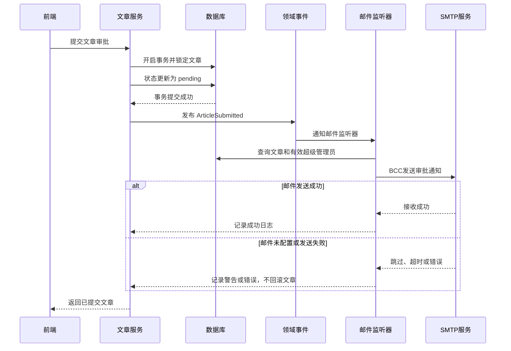
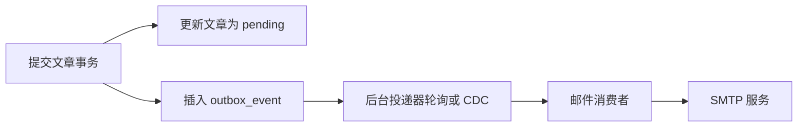

# 业务事件通知与可靠投递设计

## 1. 文档目的

本文以“文章提交审批后向超级管理员发送邮件”为例，总结在业务系统中实现通知功能时
需要掌握的通用知识。这些原则与具体编程语言、Web 框架和邮件服务商无关，同样适用于：

- 邮件、短信、站内信和移动推送。
- Webhook、企业微信、钉钉和 Slack 通知。
- 订单创建、支付成功、审批发起和库存预警等业务事件。

本文帮助开发者回答以下问题：

- 通知应该放在业务事务之前、之中还是之后？
- 邮件失败时，业务操作应该成功还是失败？
- 如何避免重复发送和漏发？
- 同步发送、异步事件、消息队列和 Outbox 应该如何选择？
- 收件人、模板、隐私、安全、重试和监控需要注意什么？
- 当前实现有什么能力、限制和未来演进方向？

## 2. 需求分析

当前需求：

> 文章作者点击“提交审批”后，向所有有效的超级管理员发送邮件。

它实际上包含多个需要明确的业务规则：

1. “提交”指文章从草稿、已通过或已拒绝状态进入审批中状态。
2. 只有文章状态变更成功后才能发送通知。
3. 收件人是 `isSuper = true`、账号有效且邮箱非空的用户。
4. 同一次有效提交只应产生一次通知事件。
5. 邮件中应包含文章标题、ID、作者和可选审核链接。
6. 邮件发送失败不应把已经成功提交的文章回滚到原状态。
7. 日志不能输出 SMTP 密码、邮件凭证或不必要的个人信息。

实现通知前，必须先把自然语言需求转化为这些可验证的规则。否则“发送一封邮件”很容易
演变成状态不一致、重复通知或隐私泄露问题。

## 3. 核心概念

### 3.1 业务操作和副作用

文章状态变为“审批中”是核心业务操作。发送邮件是由核心业务操作产生的外部副作用。

两者具有不同性质：

| 行为 | 数据所有者 | 是否可事务回滚 | 外部依赖 |
| --- | --- | --- | --- |
| 修改文章状态 | 本系统数据库 | 可以 | 无 |
| 发送邮件 | SMTP 或邮件平台 | 通常不可以 | 有 |

数据库事务无法回滚已经发送到外部邮件服务器的邮件。反过来，SMTP 超时也不一定表示邮件
没有发送：邮件服务器可能已经接收，只是响应在网络中丢失。

这类问题被称为分布式一致性问题。它与语言无关，只要业务同时修改本地数据并调用外部
系统就会出现。

### 3.2 领域事件

领域事件用于描述已经发生的业务事实，例如：

```text
ArticleSubmitted
articleId = 123
occurredAt = 2026-07-14T10:00:00Z
```

推荐事件名称使用过去式，因为事件表示“文章已经提交”，而不是“请尝试提交文章”。

业务服务只负责完成文章状态变更并发布 `ArticleSubmitted`。邮件监听器负责决定：

- 谁需要收到通知。
- 邮件标题和正文是什么。
- 使用哪种发送渠道。
- 发送失败如何记录和处理。

这样可以降低审批业务与 SMTP 实现之间的耦合。以后增加站内信或企业微信时，只需增加
新的事件消费者，而不必继续扩大文章服务。

### 3.3 至多一次、至少一次和恰好一次

通知投递通常涉及三种语义：

- 至多一次：不会重复，但失败后可能丢失。
- 至少一次：失败会重试，通常不丢失，但可能重复。
- 恰好一次：业务上看起来只执行一次，实现成本最高。

跨数据库和邮件服务实现严格的物理“恰好一次”通常不现实。工程上更常见的方案是：

1. 使用至少一次投递。
2. 为通知生成稳定的幂等键。
3. 消费端根据幂等键去重。
4. 最终实现业务意义上的恰好一次效果。

## 4. 当前项目的实现方案

### 4.1 流程



关键顺序是：

```text
先提交数据库事务 → 再发布事件 → 再尝试发送邮件
```

不能在数据库事务提交前发送邮件。否则可能出现管理员收到“待审批”邮件，但文章事务随后
回滚、审核列表中不存在该文章的情况。

### 4.2 当前投递语义

当前实现属于事务提交后的尽力投递：

- 文章提交成功后发布内存领域事件。
- 请求等待一次邮件发送尝试。
- SMTP 设置连接和 Socket 超时，避免无限阻塞请求。
- 邮件发送异常由监听器捕获并记录。
- 邮件失败不会回滚已经提交的文章。
- 当前没有自动重试、持久化事件和失败补偿。

这是适合初期系统的简单方案，但不保证进程崩溃时邮件一定送达。例如数据库事务提交后、
事件发布前进程退出，本次通知会丢失。

### 4.3 模块职责

```text
ArticleService
  完成审批状态变更并发布 article.submitted

ArticleSubmittedListener
  查询文章、作者和超级管理员，构造通知内容

EmailService
  封装 SMTP 连接和邮件发送

EmailConfig
  管理 SMTP、发件人、超时和审核地址配置
```

业务服务不直接依赖 Nodemailer 或 SMTP 配置。邮件传输能力可以被其他通知场景复用。

## 5. SMTP 配置

```env
EMAIL_ENABLED=true
EMAIL_HOST=smtp.example.com
EMAIL_PORT=465
EMAIL_SECURE=true
EMAIL_USER=your-account
EMAIL_PASSWORD=your-password-or-app-token
EMAIL_FROM=CMS <no-reply@example.com>
EMAIL_CONNECTION_TIMEOUT_MS=10000
EMAIL_ARTICLE_REVIEW_URL=https://cms.example.com/admin/reviews/articles
```

说明：

- 未启用邮件时，系统保持可启动并记录跳过日志。
- 465 端口通常使用隐式 TLS，`EMAIL_SECURE=true`。
- 587 端口通常使用 STARTTLS，通常设置 `EMAIL_SECURE=false`。
- 部分邮件服务要求使用应用专用密码，而不是网页登录密码。
- 审核地址可选，配置后邮件会显示“前往文章审核”链接。
- 生产环境凭证应保存到密钥管理服务，不能写入代码或提交 Git。

上线前应根据邮件服务商文档确认端口、TLS 和认证方式，并测试发件域名的 SPF、DKIM 和
DMARC 配置，降低邮件进入垃圾箱的概率。

## 6. 收件人解析

当前收件人规则：

```text
isSuper = true
status = 1
email 不为 null
email 去除空格后不为空
```

查询发生在事件消费时，而不是把管理员邮箱写进事件。这可以获得发送时的最新管理员列表，
也避免事件负载包含个人信息。

多个收件人使用 BCC，避免超级管理员在邮件头中看到其他管理员邮箱。需要考虑：

- 对邮箱地址去重。
- 账号停用后不再发送。
- 没有有效收件人时记录可检索的警告。
- 收件人数量很大时分批发送，避免超过邮件服务商限制。

“超级管理员”是业务角色，而不是固定邮箱配置。直接在环境变量中写死管理员邮箱会导致
人员变化后配置容易过期。

## 7. 事务边界

### 7.1 为什么不能在事务内发送邮件

把 SMTP 调用放进数据库事务会导致：

- 网络延迟延长数据库锁持有时间。
- SMTP 超时导致事务长时间不释放。
- 数据库连接池和锁资源被外部服务拖垮。
- 邮件成功、数据库提交失败时无法撤回邮件。

数据库事务应该尽量短，只覆盖需要原子提交的本地数据修改。

### 7.2 为什么邮件失败不回滚提交

邮件是通知渠道，不是文章提交成立的必要条件。文章已经进入审批队列后，如果因为邮件平台
短暂故障而告诉用户“提交失败”，用户可能再次点击提交并产生更多混乱。

更合理的行为是：

- 核心业务状态保持成功。
- 记录邮件失败。
- 通过重试或补偿机制恢复通知。
- 审批员仍可从审核列表看到文章。

如果某个业务确实要求“通知成功才算操作成功”，需要先重新审视需求，因为外部通知通常
不适合作为强事务的一部分。

## 8. 幂等和重复通知

### 8.1 重复来源

- 用户双击提交按钮。
- 前端因超时重试。
- 网关或消息系统重投。
- 消费者处理成功但确认消息失败。
- 管理员手工执行补偿任务。

当前文章状态机可以阻止文章在 `pending` 状态下再次提交，因此普通重复点击不会再次发布
事件。但未来引入至少一次消息投递后仍需要通知级幂等。

### 8.2 幂等键

推荐使用稳定业务标识：

```text
article-submitted:{articleId}:{submissionVersion}
```

不能只使用随机消息 ID，因为同一业务事件重建消息时会生成不同随机值，无法识别重复。

可以在通知记录表中对幂等键建立唯一索引。消费者发送前插入记录或以原子方式更新状态，
数据库唯一约束负责处理并发去重。

### 8.3 文章重复提交

文章被拒绝后允许再次提交，因此 `articleId` 本身不能作为永久幂等键。需要增加：

- 提交版本号 `submissionVersion`；或
- 每次提交生成并持久化 `submissionId`。

这样同一轮提交不会重复通知，不同轮重新提交仍会正常发送。

## 9. 邮件内容和安全

### 9.1 HTML 转义

文章标题和作者名称来自业务数据，插入 HTML 邮件前必须转义：

```text
&  → &amp;
<  → &lt;
>  → &gt;
"  → &quot;
'  → &#39;
```

否则恶意标题可能破坏邮件结构或生成欺骗链接。

### 9.2 邮件头注入

主题中的换行符必须移除。攻击者可能通过 `\r` 或 `\n` 尝试插入额外邮件头。即使邮件库
通常会防护，业务层仍应对动态主题做规范化。

### 9.3 链接安全

- 审核链接必须来自受控配置，不能由文章内容直接提供。
- 使用 HTTPS。
- 链接只负责导航，不能在 URL 中携带 JWT、密码或一次性敏感数据。
- 用户打开页面后仍必须经过正常登录和 `article:approve` 权限校验。

邮件中的链接不是授权凭证，不能因为用户能打开邮件就绕过后端权限。

### 9.4 日志安全

禁止记录：

- SMTP 密码和应用专用密码。
- 完整认证 Token。
- 邮件正文中的敏感业务信息。
- 不必要的完整收件人列表。

推荐记录文章 ID、通知类型、收件人数、投递结果、耗时和邮件服务返回的非敏感消息 ID。

## 10. 同步和异步的选择

| 方案 | 优点 | 缺点 | 适用场景 |
| --- | --- | --- | --- |
| 业务代码直接发邮件 | 最简单 | 强耦合、难扩展 | 临时原型 |
| 内存事件 + 同步等待 | 解耦、可确认已尝试 | 增加请求延迟、进程崩溃会丢 | 当前阶段 |
| 内存事件 + 后台执行 | 响应快 | 无持久化、失败易丢失 | 非关键提示 |
| 消息队列 | 可重试、削峰、扩展性好 | 运维和一致性复杂 | 高并发通知 |
| Transactional Outbox | 数据和事件不丢失 | 需要事件表和投递任务 | 可靠业务通知 |

不能只看到“异步更快”。异步是否可靠取决于任务是否被持久化。将 Promise 放到后台但不
保存任务，进程退出时任务仍会丢失。

## 11. Transactional Outbox

### 11.1 要解决的问题

普通流程存在两个独立操作：

```text
提交文章事务
发布通知事件
```

如果进程在两者之间退出，文章已经是 `pending`，但没有任何系统知道需要发送邮件。

Outbox 将“文章状态变更”和“写入待投递事件”放进同一个数据库事务：



只要数据库事务成功，待投递事件一定存在。后台投递器可以在服务重启后继续处理。

### 11.2 Outbox 表建议字段

```text
id
event_type
aggregate_type
aggregate_id
payload
idempotency_key
status
attempt_count
next_attempt_at
created_at
processed_at
last_error
```

`payload` 应只保存消费者需要的最小信息。对于文章提交通知，可以只保存文章 ID 和提交
版本，让消费者查询最新数据。

### 11.3 投递器

后台任务：

1. 批量锁定待发送事件。
2. 发布到消息队列或直接调用通知消费者。
3. 成功后标记已处理。
4. 失败后增加次数并计算下次重试时间。
5. 超过阈值后进入死信状态并告警。

多实例部署时需要使用跳过已锁定记录、租约或分布式锁，避免多个实例同时处理同一事件。

## 12. 重试策略

### 12.1 哪些错误可以重试

可以重试：

- 网络超时或连接重置。
- 邮件服务临时不可用。
- SMTP 4xx 临时错误。
- 服务商限流。

通常不应自动重试：

- 邮箱地址格式错误。
- SMTP 认证失败。
- 发件域名未授权。
- 邮件内容违反服务商策略。
- SMTP 5xx 永久错误。

错误分类比“所有错误都重试三次”更重要。永久错误持续重试只会增加负载并延迟告警。

### 12.2 指数退避

推荐：

```text
delay = min(base × 2^attempt + jitter, maxDelay)
```

随机抖动 `jitter` 可以避免大量失败任务在同一时刻再次冲击邮件服务。

示例重试间隔：1 分钟、5 分钟、30 分钟、2 小时。超过最大次数后进入死信队列，由运维
或管理员处理。

## 13. 可观测性

仅打印“邮件发送失败”不足以支撑生产排障。建议建设：

### 13.1 结构化日志

```json
{
  "event": "article_submission_email",
  "articleId": 123,
  "recipientCount": 2,
  "status": "sent",
  "durationMs": 340,
  "providerMessageId": "..."
}
```

### 13.2 指标

- 通知产生数量。
- 发送成功、失败和跳过数量。
- SMTP 请求耗时分布。
- 重试次数和死信数量。
- Outbox 待处理数量及最老事件等待时间。
- 没有有效超级管理员邮箱的次数。

### 13.3 告警

- 连续发送失败率超过阈值。
- Outbox 积压持续增长。
- SMTP 认证失败。
- 死信队列出现新记录。
- 系统存在超级管理员但没有有效通知邮箱。

## 14. 模板管理和国际化

随着通知增加，不应在监听器中持续拼接 HTML。后续可以引入模板层：

```text
template_key = article_submitted
locale = zh-CN
version = 3
variables = { articleTitle, authorName, reviewUrl }
```

模板需要：

- 文本和 HTML 两种格式。
- 变量白名单和默认值。
- HTML 自动转义。
- 模板版本控制和预览。
- 多语言支持。
- 邮件客户端兼容性测试。

通知事件不应直接保存已经渲染的最终 HTML，除非业务要求保留当时完整通知快照。

## 15. 前端配合

当前需求不要求前端调用新的邮件接口。前端继续调用：

```http
POST /api/articles/:id/submit
Authorization: Bearer <accessToken>
```

后端在文章状态提交成功后触发邮件。前端需要注意：

- 防止按钮重复点击，提交期间显示 Loading。
- 成功后刷新文章状态为 `pending`。
- 邮件失败不会改变提交成功响应，不能提示用户“邮件一定送达”。
- 如果未来接口返回通知状态，可以显示“已提交，通知正在发送”。
- 不要由前端直接向 SMTP 或邮件平台发送管理员通知，否则会泄露凭证并可被绕过。

通知收件人和内容规则必须由后端控制，因为前端数据不能被信任。

## 16. 当前实现的限制

当前实现已经具备：

- 文章事务提交后触发领域事件。
- 查询最新有效超级管理员邮箱。
- SMTP 配置校验和发送超时。
- 纯文本与 HTML 邮件。
- 动态内容 HTML 转义和主题换行清理。
- 使用 BCC 保护收件人隐私。
- 邮件错误隔离，不回滚文章状态。
- 成功、跳过和失败日志。

当前尚未具备：

- 持久化 Outbox。
- 自动重试和死信队列。
- 通知级幂等记录。
- 邮件模板管理。
- 管理端发送历史查询。
- 多渠道通知和用户通知偏好。
- 服务商故障切换。

## 17. 未来演进路线

### 第一阶段：当前方案

- 内存领域事件。
- SMTP 尽力发送。
- 失败记录日志。
- 适用于通知量小、偶尔漏信可人工处理的阶段。

### 第二阶段：可靠投递

- 增加提交版本或 submissionId。
- 增加 Outbox 表。
- 后台任务重试。
- 唯一幂等键。
- 死信和监控告警。

### 第三阶段：通知中心

- 独立通知服务。
- 邮件、短信、站内信和企业 IM 多渠道。
- 模板、国际化和用户偏好。
- 通知历史和管理端补发。
- 消息队列削峰和多服务商容灾。

是否升级不应只看技术先进程度，而应基于通知重要性、发送规模、允许漏发率、团队运维能力
和合规要求决定。

## 18. 测试清单

### 18.1 业务流程

- 草稿首次提交只发送一次通知。
- 已拒绝和已通过文章重新提交会再次通知。
- `pending` 或已下架状态提交失败且不发送邮件。
- 已撤回且有效的文章重新提交会再次发送邮件。
- 非作者提交失败且不发送邮件。
- 事务回滚时不发送邮件。

### 18.2 收件人

- 所有有效超级管理员都能收到通知。
- 普通管理员不会收到通知。
- 停用的超级管理员不会收到通知。
- 空邮箱不会作为收件人。
- 重复邮箱被去重。
- 多个收件人之间看不到彼此邮箱。
- 没有有效收件人时提交仍成功并记录警告。

### 18.3 邮件内容

- 标题、作者、文章 ID 正确。
- 配置审核 URL 后链接正确。
- 特殊字符被 HTML 转义。
- 标题换行不能注入邮件头。
- 同时提供文本和 HTML 内容。

### 18.4 异常

- 邮件功能关闭时文章仍可提交。
- SMTP 认证失败时文章状态保持 `pending`。
- SMTP 超时时请求不会无限等待。
- 发送失败有错误日志且不泄露密码。
- 重复点击不会产生重复事件。

## 19. 实施检查表

- [ ] 明确通知触发的业务状态变化。
- [ ] 核心数据库事务先于外部通知。
- [ ] 业务服务和具体通知渠道解耦。
- [ ] 明确邮件失败是否影响核心业务结果。
- [ ] 收件人由后端根据最新数据解析。
- [ ] 动态主题和 HTML 内容经过安全处理。
- [ ] 多收件人使用 BCC 或单独发送。
- [ ] SMTP 设置合理超时。
- [ ] 凭证只保存在安全配置中。
- [ ] 定义幂等键和重复处理策略。
- [ ] 明确当前投递保证和可能丢失的窗口。
- [ ] 关键通知使用 Outbox、重试和死信。
- [ ] 建立发送成功率、延迟和积压监控。
- [ ] 前端防止重复提交，但不把前端防抖当作后端幂等。

## 20. 总结

实现邮件通知的重点不是调用 SMTP API，而是正确处理核心业务与外部副作用之间的边界。
一个可靠的方案需要同时考虑事务一致性、事件解耦、幂等、重试、收件人解析、安全、隐私和
可观测性。

当前 CMS 采用事务提交后的内存事件和尽力邮件投递，复杂度低且不会让 SMTP 故障破坏文章
审批状态。未来当邮件成为不可丢失的关键业务通知时，应使用 Transactional Outbox、持久化
幂等键、指数退避重试和死信处理，将方案升级为可恢复、可审计的可靠通知系统。
