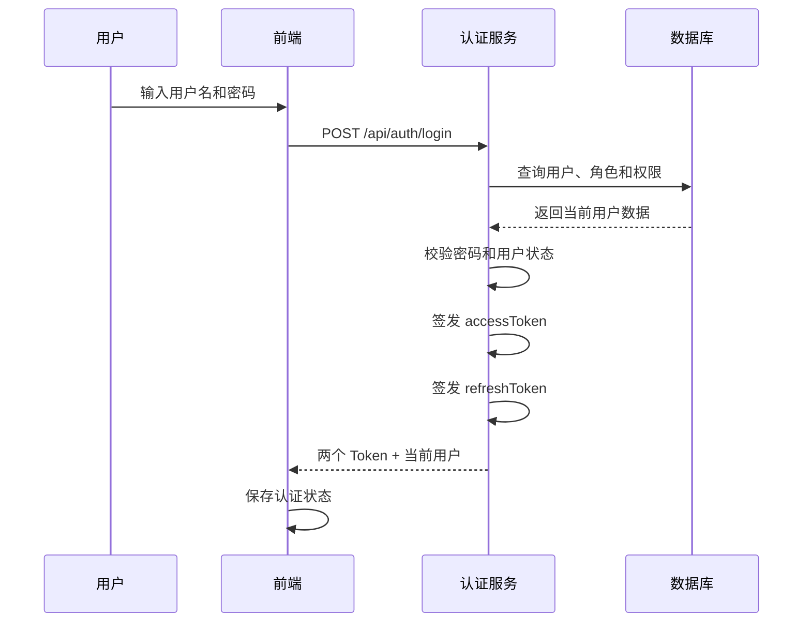
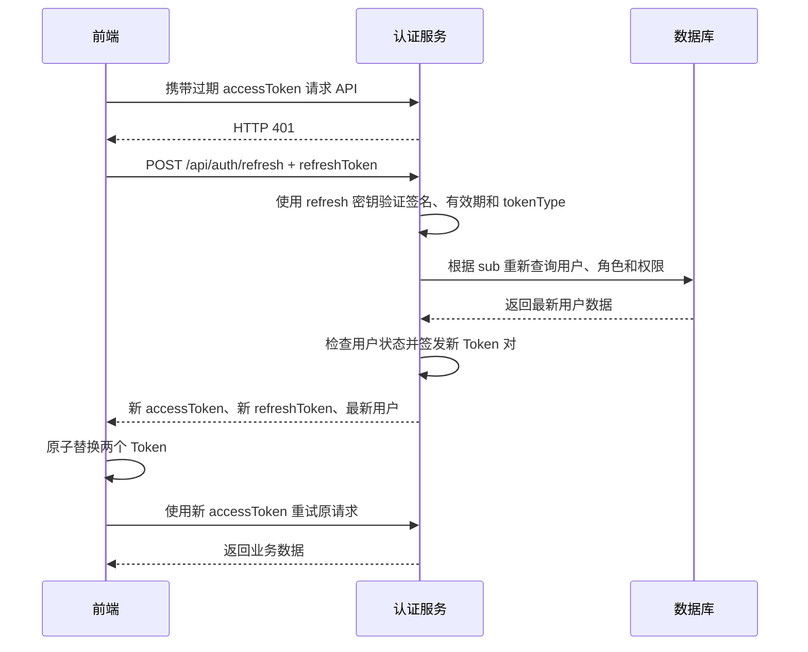

# 双 Token 认证设计与实践

## 1. 文档目的

本文说明一个前后端分离系统如何设计和实现双 Token 认证，帮助开发者理解：

- 什么是 accessToken 和 refreshToken。
- 为什么单 Token 方案存在体验与安全之间的矛盾。
- 双 Token 能解决什么问题，又不能解决什么问题。
- 后端如何签发、校验和刷新 Token。
- 前端如何保存 Token、自动刷新并处理并发请求。
- 实现过程中容易遗漏的安全细节。
- 如何从无状态 JWT 演进到可撤销、可审计的登录会话体系。

本文同时记录当前 CMS 项目的实现约定。示例以 NestJS、JWT 和 Axios 为主，但核心设计
同样适用于其他后端框架和前端请求库。

## 2. 什么是双 Token

双 Token 认证会在用户登录成功后签发两个用途不同的凭证：

| Token | 用途 | 推荐有效期 | 使用频率 |
| --- | --- | --- | --- |
| accessToken | 访问受保护的业务接口 | 较短，如 15 分钟 | 每次 API 请求 |
| refreshToken | accessToken 过期后换取新 Token | 较长，如 7～30 天 | 仅刷新时使用 |

accessToken 是日常通行证，泄露后的可利用时间应尽量短。refreshToken 是续期凭证，
使用频率低、生命周期长，因此必须被更严格地保护。

双 Token 并不是让同一个 JWT 拥有两个名称。两个 Token 必须在用途、有效期和校验规则
上明确隔离。推荐进一步使用不同签名密钥。

## 3. 为什么使用双 Token

### 3.1 单 Token 的矛盾

如果系统只有一个 Token：

- 有效期很短：安全性较好，但用户频繁掉线，体验差。
- 有效期很长：体验较好，但 Token 泄露后攻击窗口很长。

双 Token 将“访问接口”和“保持登录”两个职责拆开：

- accessToken 保持短生命周期，降低泄露风险。
- refreshToken 负责静默续期，减少用户重新登录次数。

### 3.2 主要收益

1. 缩短业务访问凭证的暴露窗口。
2. 用户可长期保持登录，同时无需给 accessToken 设置很长有效期。
3. 可以对刷新行为单独增加更严格的校验、审计和风控。
4. 后续容易扩展 Token 轮换、设备管理、强制下线和会话撤销。
5. 用户角色或权限发生变化时，可在刷新阶段重新加载最新数据。

### 3.3 双 Token 不能自动解决的问题

双 Token 不是完整的账号安全体系。仅使用无状态 JWT 时仍存在以下限制：

- 已签发的 refreshToken 在过期前无法主动撤销。
- refreshToken 被窃取后，攻击者仍可以持续刷新。
- 简单地返回一个新 refreshToken，并不会自动让旧 Token 失效。
- 无法精确查看和管理用户在哪些设备上登录。

要解决这些问题，需要增加服务端会话状态，详见“未来优化方案”。

## 4. 当前项目的设计约定

### 4.1 Token 负载

当前 Token 使用以下核心负载：

```ts
type TokenType = 'access' | 'refresh'

interface TokenPayload {
  sub: number
  tokenType: TokenType
  jti: string
}
```

字段含义：

- `sub`：用户 ID，服务端据此重新查询用户。
- `tokenType`：明确 Token 用途，防止 refreshToken 被用于普通接口。
- `jti`：本次签发的唯一标识，保证轮换后的 Token 不相同，并为未来撤销和审计预留依据。
- `iat`：JWT 自动生成的签发时间。
- `exp`：JWT 根据 `expiresIn` 自动生成的过期时间。

JWT 中不保存用户权限。用户状态、角色和权限可能随时变化，服务端在认证和刷新时都从
数据库重新加载当前用户。

### 4.2 配置

```env
# 兼容旧部署
JWT_SECRET=至少32位随机字符串
JWT_EXPIRES_IN=7200

# 推荐生产配置
JWT_ACCESS_SECRET=accessToken专用的至少32位随机字符串
JWT_ACCESS_EXPIRES_IN=900
JWT_REFRESH_SECRET=refreshToken专用的至少32位随机字符串
JWT_REFRESH_EXPIRES_IN=604800
```

建议：

- accessToken 默认 15 分钟，即 900 秒。
- refreshToken 默认 7 天，即 604800 秒。
- 两个密钥使用密码学安全的随机值，且内容不同。
- 密钥只放在环境变量或密钥管理服务中，不提交到 Git。
- 生产环境应定期轮换密钥，并制定旧密钥过渡策略。

当前项目保留 `JWT_SECRET` 和 `JWT_EXPIRES_IN` 作为兼容配置。未单独设置 refresh 密钥
时，系统会基于 access 密钥生成不同的默认 refresh 密钥；生产环境仍应显式配置两个
独立密钥。

## 5. 完整认证流程

### 5.1 登录流程



登录成功响应：

```json
{
  "code": 0,
  "message": "success",
  "data": {
    "accessToken": "access JWT",
    "refreshToken": "refresh JWT",
    "user": {
      "id": 1,
      "username": "admin",
      "isSuper": true,
      "permissions": []
    }
  }
}
```

后端签发两个 Token 时应显式指定 Token 类型、密钥和有效期：

```ts
const [accessToken, refreshToken] = await Promise.all([
  jwtService.signAsync(
    { sub: userId, tokenType: 'access', jti: randomUUID() },
    { secret: accessSecret, expiresIn: accessExpiresIn },
  ),
  jwtService.signAsync(
    { sub: userId, tokenType: 'refresh', jti: randomUUID() },
    { secret: refreshSecret, expiresIn: refreshExpiresIn },
  ),
])
```

两次签发可以并行执行。不要只修改过期时间而使用完全相同的校验规则，否则 refreshToken
可能被错误地当成 accessToken。

### 5.2 普通接口认证

前端只在普通请求头中携带 accessToken：

```http
Authorization: Bearer <accessToken>
```

后端认证守卫执行：

1. 从 `Authorization` 请求头提取 Bearer Token。
2. 使用 accessToken 专用密钥验证签名和有效期。
3. 检查 `tokenType === 'access'`。
4. 检查 `sub`、`jti` 等必要负载是否合法。
5. 根据 `sub` 重新查询用户、角色和权限。
6. 检查用户是否存在、是否启用。
7. 将当前用户挂到请求对象，继续执行权限守卫。

即使两个密钥被误配为相同值，`tokenType` 校验仍能阻止 refreshToken 访问普通接口。

### 5.3 刷新流程



刷新接口：

```http
POST /api/auth/refresh
Content-Type: application/json
```

```json
{
  "refreshToken": "当前 refreshToken"
}
```

刷新接口必须满足：

- 使用 `@Public()` 跳过全局 accessToken 守卫。
- `@Public()` 只表示不要求 accessToken，不表示无需认证。
- 服务内部必须使用 refresh 密钥执行 `verify`。
- 必须检查 `tokenType === 'refresh'`。
- 必须重新查询用户并检查启用状态。
- 成功后同时轮换 accessToken 和 refreshToken。
- 返回最新用户权限，前端同步更新当前用户状态。

不要直接相信 refreshToken 中的角色或权限，也不要把完整权限列表长期写入 JWT。

## 6. 后端实现结构

当前项目相关文件：

```text
src/auth/auth.controller.ts          登录、刷新、当前用户接口
src/auth/auth.service.ts             密码校验、Token 签发和刷新
src/auth/jwt-auth.guard.ts           普通接口 accessToken 校验
src/auth/token-payload.ts            Token 类型和负载定义
src/auth/dto/refresh-token.dto.ts    刷新请求参数校验
src/shared/config/auth.config.ts     密钥和有效期配置
```

### 6.1 控制器

```ts
@Public()
@Post('refresh')
refresh(@Body() dto: RefreshTokenDto) {
  return authService.refresh(dto.refreshToken)
}
```

### 6.2 DTO 校验

```ts
export class RefreshTokenDto {
  @IsString()
  @IsJWT()
  refreshToken!: string
}
```

DTO 只能保证字符串具有 JWT 格式。签名、有效期、Token 类型和用户状态仍必须由认证服务
校验。

### 6.3 错误约定

| 场景 | HTTP 状态 | 说明 |
| --- | --- | --- |
| 未提供 accessToken | 401 | 用户未登录 |
| accessToken 过期或无效 | 401 | 前端可以尝试刷新 |
| 使用 refreshToken 访问业务接口 | 401 | Token 类型错误 |
| refreshToken 过期或无效 | 401 | 前端必须退出登录 |
| 用户被删除或停用 | 401 | 两种 Token 均不能继续使用 |
| 用户已登录但缺少资源权限 | 403 | 不应触发 Token 刷新 |

401 表示认证失败，403 表示身份有效但没有权限。前端不能在收到 403 时尝试刷新 Token。

## 7. 前端配合实现

### 7.1 状态模型

```ts
interface AuthState {
  accessToken: string | null
  refreshToken: string | null
  user: CurrentUser | null
  initialized: boolean
}
```

登录和刷新成功时，都必须一次性更新：

- accessToken
- refreshToken
- user

不要只替换 accessToken，否则下一次刷新可能继续使用旧 refreshToken。

### 7.2 Token 存储

从安全性考虑，推荐顺序如下：

1. accessToken 仅保存在内存中。
2. refreshToken 由后端通过 `HttpOnly + Secure + SameSite` Cookie 保存。
3. 页面刷新后调用 refresh 接口恢复 accessToken。

当前项目通过 JSON 返回两个 Token，前端可以暂时持久化 refreshToken。需要认识到：

- localStorage 和普通 Cookie 中的 Token 可被页面 JavaScript 读取。
- 一旦发生 XSS，攻击脚本可能窃取长期 refreshToken。
- HttpOnly Cookie 可以降低 Token 被 JavaScript 直接读取的风险，但同时需要考虑 CSRF。

### 7.3 请求拦截器

请求拦截器只添加 accessToken：

```ts
http.interceptors.request.use((config) => {
  if (authStore.accessToken) {
    config.headers.Authorization = `Bearer ${authStore.accessToken}`
  }
  return config
})
```

不要把 refreshToken 放到普通业务请求头中。它只应该发送到刷新接口。

### 7.4 自动刷新与请求重试

响应拦截器应在业务接口返回 401 后：

1. 判断当前请求不是登录或刷新接口。
2. 判断该请求尚未重试。
3. 发起或等待全局唯一的刷新 Promise。
4. 刷新成功后使用新 accessToken 重试原请求。
5. 刷新失败后清空登录态并进入登录页。

核心示例：

```ts
let refreshPromise: Promise<void> | null = null

async function handleUnauthorized(request: RetryableRequest) {
  if (request._retried || isAuthRequest(request)) throw originalError
  request._retried = true

  refreshPromise ??= authStore.refresh().finally(() => {
    refreshPromise = null
  })

  await refreshPromise
  request.headers.Authorization = `Bearer ${authStore.accessToken}`
  return http(request)
}
```

### 7.5 为什么要合并并发刷新

一个页面通常会并发请求用户、菜单、字典和列表数据。当 accessToken 过期时，它们可能
同时返回 401。如果每个请求都独立刷新，会出现：

- 短时间产生多个 refresh 请求。
- 新 Token 被后返回的旧请求结果覆盖。
- 引入服务端 Token 轮换后，后续刷新可能因旧 Token 已撤销而失败。
- 原始业务请求被重复执行。

因此整个前端应用同一时刻只能有一个刷新请求，其他请求等待同一个 Promise。

### 7.6 防止刷新死循环

必须满足以下任一条件：

- 刷新接口使用独立、没有自动刷新拦截器的 HTTP 客户端；或
- 响应拦截器明确排除 `/api/auth/login` 和 `/api/auth/refresh`。

同时给重试过的请求增加 `_retried` 标记。否则 refresh 接口返回 401 后可能再次调用
refresh，形成无限循环。

### 7.7 页面启动

推荐启动顺序：

1. 从持久化存储恢复 refreshToken 和可选的 accessToken。
2. accessToken 存在时请求 `GET /api/auth/me`。
3. `/me` 返回 401 时执行一次自动刷新并重试。
4. 只有 refreshToken 时直接刷新，获取 accessToken 和当前用户。
5. 刷新失败时清理认证状态并进入登录页。
6. 完成后设置 `initialized = true`，再渲染需要权限的路由。

这样可以避免应用启动时菜单短暂显示错误或页面重复跳转。

## 8. 权限变化与双 Token

JWT 只保存用户 ID，而不是权限快照。每次普通接口认证和刷新都会重新查询用户，因此：

- 用户被停用后，已有 accessToken 和 refreshToken 都无法继续使用。
- 角色资源发生变化后，下一次请求即可获得最新权限判断结果。
- 刷新响应和 `GET /api/auth/me` 会返回最新 `permissions`。
- 超级管理员继续通过 `isSuper: true` 放行。

这种设计会增加数据库查询，但避免权限在 Token 有效期内长期过时。未来可通过短期缓存降低
查询压力，并在角色变更时主动删除缓存。

## 9. 安全注意事项

### 9.1 必须做

- accessToken 和 refreshToken 设置明显不同的有效期。
- 使用不同签名密钥，并检查 `tokenType`。
- refresh 接口重新检查用户状态。
- 使用 HTTPS，防止 Token 在传输中被截获。
- 日志中禁止打印完整 Token。
- 禁止把密钥提交到代码仓库。
- 前端仅对 401 尝试刷新，403 保持登录状态。
- refresh 失败后彻底清除两个 Token。

### 9.2 不应该做

- 不应把 refreshToken 当作 Bearer Token 调用业务 API。
- 不应只解析 JWT 而不验证签名。
- 不应信任客户端传入的用户 ID、角色或权限。
- 不应把密码、密钥或敏感数据放入 JWT 负载。
- 不应依赖前端按钮隐藏替代后端权限守卫。
- 不应无限次重试 401 请求。

### 9.3 JWT 负载不是加密数据

JWT 的 payload 通常只是 Base64URL 编码，客户端可以读取。签名保证数据未被篡改，
并不保证内容保密。因此 payload 只应包含必要且非敏感的信息。

## 10. 当前方案的限制

当前 CMS 使用无状态双 JWT，没有保存 refresh 会话。优点是实现简单、服务端无需额外
存储，适合第一阶段上线。限制包括：

- 用户主动退出只会清除客户端 Token，服务端不能立即撤销 refreshToken。
- 刷新后旧 refreshToken 在自身过期前仍然有效。
- 无法检测旧 refreshToken 是否被重复使用。
- 无法按设备查看、终止登录会话。
- 密钥泄露时影响范围较大，需要整体轮换。

`jti` 已经加入负载，为后续服务端会话控制预留了标识，但当前尚未持久化和校验 `jti`。

## 11. 未来优化方案

### 11.1 引入 refresh 会话表或 Redis

保存以下信息：

```text
session_id / jti
user_id
refresh_token_hash
expires_at
revoked_at
replaced_by_jti
device_name
ip_address
user_agent
created_at
last_used_at
```

数据库中只保存 refreshToken 的哈希，不保存明文 Token。即使会话表泄露，攻击者也不能
直接拿数据库内容调用刷新接口。

### 11.2 真正的 refreshToken 轮换

有状态轮换流程：

1. 校验 JWT 签名和 `tokenType`。
2. 根据 `jti` 查询有效会话。
3. 比对 refreshToken 哈希。
4. 将旧会话标记为已撤销。
5. 创建新 `jti` 和新会话。
6. 返回新的 Token 对。

如果一个已撤销的 refreshToken 再次被使用，可能表示 Token 被复制。系统可以撤销该用户
同一 Token 家族或全部设备会话，并记录安全告警。

### 11.3 增加退出和会话管理接口

```text
POST   /api/auth/logout
POST   /api/auth/logout-all
GET    /api/auth/sessions
DELETE /api/auth/sessions/:id
```

支持退出当前设备、退出全部设备和远程下线指定设备。

### 11.4 使用 HttpOnly Cookie 保存 refreshToken

后端通过 Cookie 返回 refreshToken：

```text
HttpOnly
Secure
SameSite=Lax 或 Strict
Path=/api/auth
```

同时加入 CSRF 防护、Origin/Referer 校验，并严格配置跨域凭证策略。accessToken 仍可以只
保存在内存中。

### 11.5 风险控制

可以对 refresh 接口增加：

- 用户和 IP 维度限流。
- 设备指纹或会话绑定。
- 异常地区、IP 或 User-Agent 变化检测。
- 高风险操作前重新验证密码或启用 MFA。
- 登录与刷新审计日志。

### 11.6 密钥轮换

为 JWT Header 增加 `kid`，服务端同时维护当前密钥和过渡期旧密钥：

1. 新 Token 使用新密钥签发。
2. 在过渡期内允许旧密钥验证存量 Token。
3. 等待旧 Token 最大有效期结束后移除旧密钥。

密钥可托管到云 KMS、Vault 或专门的 Secrets Manager。

### 11.7 权限查询缓存

认证守卫每次请求重新查询用户权限可以保证实时性，但请求量增加后可引入短期缓存：

- 缓存键包含用户 ID 或权限版本号。
- 用户、角色、资源关系变化时主动失效缓存。
- 用户表增加 `authVersion`，密码修改、强制下线时递增。
- Token 中携带签发时的版本，版本不一致时拒绝认证。

## 12. 测试清单

### 12.1 登录和签发

- 正确密码返回两个 Token。
- 错误密码返回 401。
- 停用用户无法登录。
- 两个 Token 的 `tokenType`、密钥和有效期不同。
- 每次签发都有不同 `jti`。

### 12.2 普通接口

- accessToken 可以访问受保护接口。
- refreshToken 访问普通接口返回 401。
- 过期、伪造或篡改后的 accessToken 返回 401。
- 用户停用后，未过期 accessToken 仍被拒绝。

### 12.3 刷新接口

- 有效 refreshToken 返回新 Token 对和最新用户。
- accessToken 调用刷新接口返回 401。
- 过期、伪造或篡改后的 refreshToken 返回 401。
- 刷新后两个 Token 均发生变化。
- 用户停用后 refreshToken 无法刷新。
- 角色权限变化后刷新响应返回最新权限。

### 12.4 前端

- 单个 401 能刷新并重试原请求。
- 多个并发 401 只发起一次 refresh 请求。
- refresh 失败不会无限循环。
- 403 不触发刷新。
- 刷新成功会同时替换两个 Token。
- 页面启动时不会短暂显示无权限菜单。

## 13. 实施检查表

后端：

- [ ] 定义 accessToken 和 refreshToken 的独立有效期。
- [ ] 配置不同签名密钥。
- [ ] Token 包含 `sub`、`tokenType` 和 `jti`。
- [ ] 普通守卫只接受 accessToken。
- [ ] refresh 接口只接受 refreshToken。
- [ ] 登录和刷新都检查用户状态。
- [ ] 刷新时重新加载最新权限。
- [ ] 统一返回 401 和 403。
- [ ] 日志不输出 Token 明文。

前端：

- [ ] 普通请求只携带 accessToken。
- [ ] 登录和刷新同时保存两个 Token。
- [ ] 使用全局唯一 refresh Promise 合并并发刷新。
- [ ] 原请求最多重试一次。
- [ ] 登录和刷新接口不参与自动刷新。
- [ ] refresh 失败后清除全部登录态。
- [ ] 403 不触发刷新。
- [ ] 页面启动阶段正确恢复登录状态。

## 14. 总结

双 Token 的核心不是“返回两个 JWT”，而是职责隔离：accessToken 用于高频、短期的接口
访问，refreshToken 用于低频、长期的登录续期。可靠实现至少需要不同有效期、独立密钥、
`tokenType` 校验、用户状态复查、Token 轮换和前端并发刷新控制。

当前无状态方案在安全性、实现复杂度和用户体验之间取得了适合项目现阶段的平衡。随着系统
对强制下线、多设备管理和安全审计的要求提高，应进一步引入 refresh 会话存储、Token
家族轮换、重放检测和 HttpOnly Cookie。
